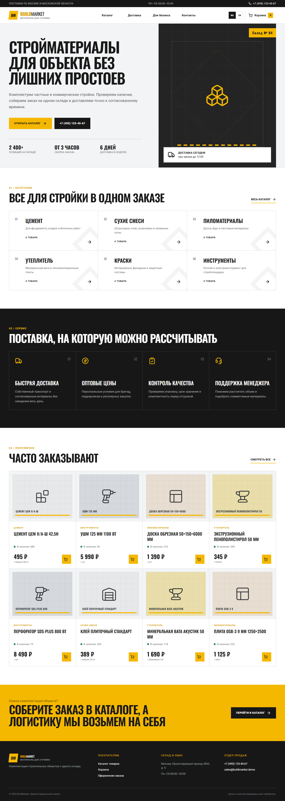
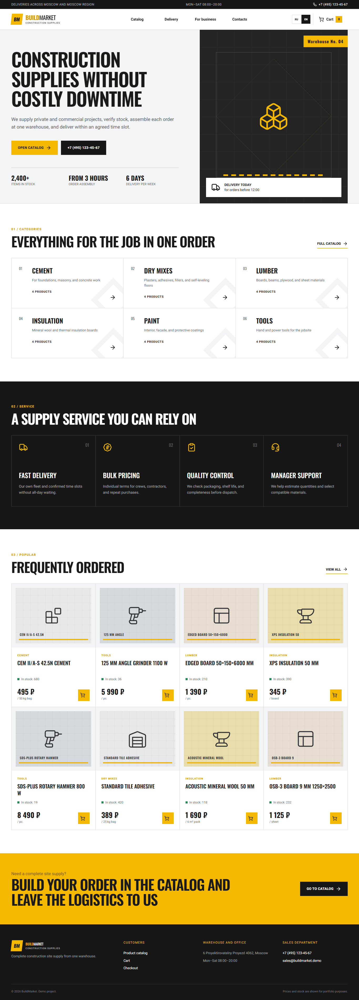

# BuildMarket Store


BuildMarket Store is a production-like e-commerce demo for a construction materials supplier. It focuses on commercial storefront structure, catalog exploration, persistent cart state, pricing rules, and a validated checkout flow.

## Live Demo

https://buildmarket-store.vercel.app

## Source Code

https://github.com/Andrey15211/buildmarket-store

## Features

- Responsive B2B storefront and category navigation
- 24 demo products across six construction categories
- Search, category/price filters, sorting, and empty states
- Static product detail routes with specifications and stock status
- Persistent cart with quantity controls and product removal
- Delivery calculation and order totals
- Validated checkout form with conditional delivery rules

## Tech Stack

- Next.js App Router
- React and TypeScript
- Tailwind CSS
- next-intl
- Zustand
- React Hook Form and Zod
- Vitest

## Localization

- RU/EN support: navigation, catalog, products, checkout, errors, and states
- Default language: Russian (`/ru`)
- Language switcher: available in the header
- Locale-prefixed routes preserve the current page

## Screenshots

### Desktop



### Mobile

Planned path: `docs/screenshots/mobile.png`

### RU/EN example



Mobile screenshot will be added after final device-width capture.

## Local Development

```bash
npm install
npm run dev
npm run build
```

The root URL redirects to `http://localhost:3000/ru`.

## Deployment

Deployed on Vercel using the default Next.js preset. No runtime environment variables are required for the portfolio demo.

## What this project demonstrates

- Commercial frontend and e-commerce UI
- Catalog filtering and derived client state
- Cart and checkout business logic
- Form validation
- Responsive localized storefront engineering

## Recommended GitHub Topics

`ecommerce` `online-store` `nextjs` `typescript` `zustand` `react-hook-form` `zod` `next-intl` `tailwindcss` `vercel`
